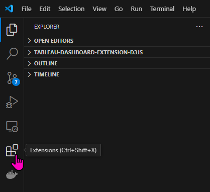
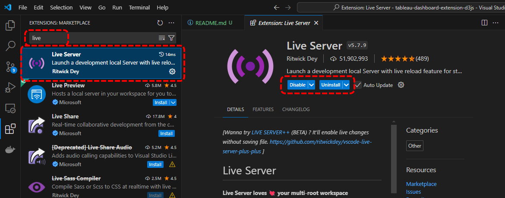
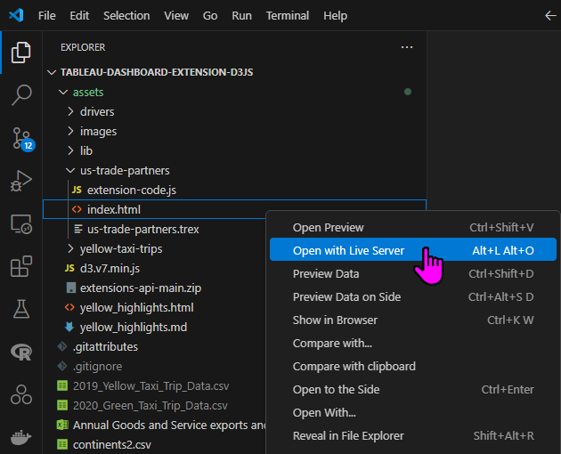
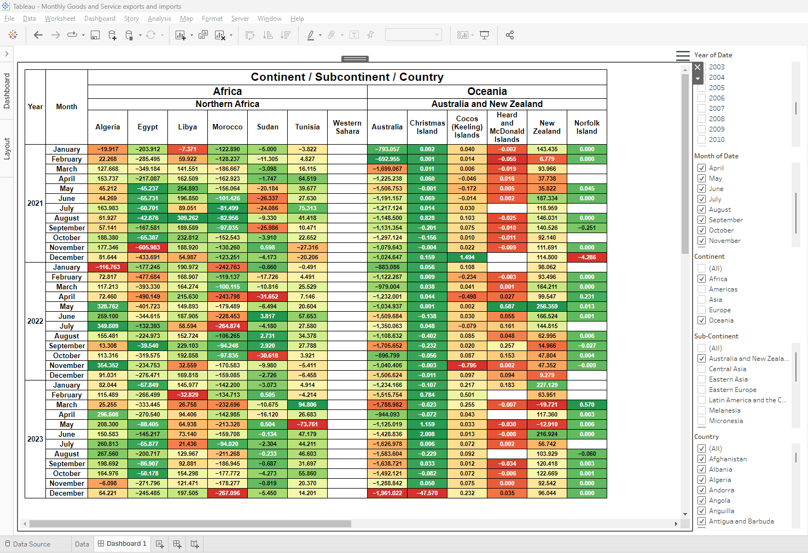

# Tableau Dashboard Extensions - Development and Deployment

Documentation on how to set up Tableau Dashboard Extension API projects

## Architecture

The way in which a Tableau Dashboard Extension works is that the Tableau tool you are using (either the desktop client, or in a final production environemnt - the Tableau server) uses a placeholder for the extension on a Tableau dashboard object (as opposed to a sheet, or a story).

That placeholder is populated by importing a manifest file having the extension ".trex" (described further). The manifest file describes the properties of the extension including the web server where the index HTML file (also decribed further) is hosted, along with other properties such as the title, author, etc.

The index HTML file in turn, can reference other resources such as stylesheets, etc. but it must also make use of JavaScript that is typically saved in a separate ".js" file. That JavaScript must also import that Tableau JavaScript API file which will allow your JavaScript to communicatewith Tableau and retrieve data from a sheet, as well as set up and react to events that could occur on the sheet such as filtering, etc.

## Development Steps in Brief

The following summary is described in greater detail below this section

1. Make sure you have Tableau Desktop client installed on your workstation.
2. Make sure you have a web developer tool such as Visual Studio Code (or others such as  JetBrains Webstorm) installed on your workstation.
3. Make sure you are able to run a web server on your workstation that can host your preliminary development efforts.
4. Create your visualization using your favorite web developer tool and test it as it's running on your local web server. You may find that it's initially easier to test just the visualization part of your project using statis data hard-coded into your files and only once you are confident that the visualization behaves as you want it, take the additional steps to connect it to your Tableau workbook which should still be launched on your workstation for now.
5. After the visualization code is working, create the Tableau Dashboard Extension manifest file, saving it with a ".trex" extension, which will allow you to add your extension project to your Tableau file.
6. Modify the other files in your project (typically .html and .js) to be able to connect to Tableau via your local web server rather than using static, hard-coded data.
7. Eventually, you will move the files used to create your extension to a remote web server so that the extension can be accessed by other users not logged in to your workstation.
8. For each new location of those resource files (.html, .js, or others), the .trex manifest file must be modified to indicate the new web server location of the index HTML file, instead of pointing to the index HTML file on your local web server.
9. The final step is to publish your Tableau workbook to the Tableau server. This workbook will be referencing the resources (.html, .js, or others) that are now bing hosted on a remote web server.

## Background

Typically, you would create a Tableau Dashboard Extension to address a shortcoming in Tableau's visualization capabilities. For example, using the D3.js framework, you could create some of the visualizations that can be seen in the [D3.js gallery](https://observablehq.com/@d3/gallery) or [alternate gallery](https://d3-graph-gallery.com). For the sake of this example, the assumption is that you eill be using D3.js as the framework to create custom visualziations.

In order to create a Tableau Dashboard extension you will make use of the [Tableau Dashboard Extensions API](https://tableau.github.io/extensions-api) whose version as of this writing is [1.12](https://github.com/tableau/extensions-api/tree/main/lib)

While D3 states that you can reference the current d3.js API file from their website (or use a CDN to reference the file), i.e.

```html
<script src="https://d3js.org/d3.v7.min.js"></script>
```

for the sake of stability, it may be useful to download the [d3.v7.min.js](assets/d3.v7.min.js) file and keep it in your project folder.

Similarly, when you download the [Tableau Dashboard Extension package](https://github.com/tableau/extensions-api/archive/refs/heads/main.zip), many files including documentation and example code are included, but you really only need the single JavaScript file that is located in the `extensions-api-main.zip\extensions-api-main\lib` folder, which is typically the minified version [tableau.extensions.1.latest.min.js](assets/lib/tableau.extensions.1.latest.min.js)

## Hosting

### Local Development - Visual Studio Code

This documentation is specific to Visual Studio Code, as this is my software of choice. Other tools can also be used, probably with similar steps, but I will not be documentaitng them here.

You will want to do your initial development using your workstation and while there may be other tools that you can use to create an HTTP server on your local machine, one of the easiest ways to do this is to use the Visual Studio Code extension (plugin) named ["Live Server"](https://marketplace.visualstudio.com/items?itemName=ritwickdey.LiveServer). To install the "Live Server" extension, click on the Manage Extensions icon on the left edge of the VS Code window, or press Ctrl-Shift-X.



Then search for the extension either by typing the first few letters of the name in the search box, or scrolling to find it in the list. If it is already installed, you will see the buttons to Disable or Uninstall. You will want this extension enabled.



Once installed, the "Live Server" extensoin creates a context menu itme when right-clicking on an HTML file, allowing you to start an http server, typically running on port 5500 unless it is unable to bind to that port.



### [Remote hosting](#remote-hosting)

There are probably numerous possibilities for you to host your dashboard extension project remotely but perhaps the most obvious one might be [Amazon Web Services](https://aws.amazon.com/free/)

## Required files and project folder structure

As far as setting up your project folder, and assuming you will be using D3.js for your visualizations, your project might look something like the following:

```txt
ProjectRoot
│   d3.v7.min.js
│
├───lib
│       tableau.extensions.1.12.0.js
│       tableau.extensions.1.12.0.min.js
│       tableau.extensions.1.latest.js
│       tableau.extensions.1.latest.min.js
│
└───ApplicationName
        extension-code.js
        index.html
```

However, if you are uploading your extension application into an existing site that you previously created for hosting other Tableau Dashboard Extension applications, you may not need to upload the `d3.v7.min.js` file and the `lib` folder with its `tableau.extensions.*.js` files, so long as your path names reference these files correctly.

A typical Tableau Dashboard Extension application will consist of 3 files, those being:

xxx.trex
xxx.html
xxx.js

where xxx can often be the same name which is equal tot he extension name. You might also want to name your xxx.html file as index.html as this the typical naming convention for your index file on http servers. The xxx.jhs file will usually be used to communicate with Tableau via the Tableau Dashboard Extension API, and also contain the rendering code based on the D3 framework. Note that the xxx.trex file is required only for adding the extension application into your Tableau workbook - it is not needed for deployment to your web hosting site.

Once you have selected a way of serving up local files through your local http server, you are ready to create your .trex file. Very typically, the file will look something like this:  


```xml
<?xml version="1.0" encoding="utf-8"?>
<manifest manifest-version="0.1" xmlns="http://www.tableau.com/xml/extension_manifest">
  <dashboard-extension id="com.YOURORG.extensions.EXTENSIONNAME" extension-version="1.0.0">
    <default-locale>en_US</default-locale>
    <name resource-id="name"/>
    <description>Sankey</description>
    <author name="YOUR NAME" email="username@yourdomain.com" organization="YOUR ORGANIZATION" website="https://www.yourdomain.com"/><!-- This is non-functional meta-data -->
    <min-api-version>1.12</min-api-version><!-- May need to be modified is using a different version of the Tableau Extension API -->
    <source-location>
      <url>http://localhost:5500/tableau-dashboard-extension-d3js/application-name/index.html</url><!-- Make sure to point this to the server hosting your extension code -->
    </source-location>
    <icon>
    <icon/>
    <permissions>
        <permission>full data</permission><!-- Required to read data from Tableau -->
    </permisisons>
  </dashboard-extension>
  <resources>
    <resource id="name">
      <text locale="en_US">Extenion application name</text>
    </resource>
  </resources>
</manifest>
```

To implement the template above into your own project, you just need to modify the sections indicated above.

## Integrating your project code with Tableau

Tableau Dashboard Extensions, as the name implies, can only be added to a Tableau Dashboard, and not to a Worksheet, or Story. That said, follow these steps to integrate your extension project with your workbook.

1. Assuming you have already created a Tableau Workbook and this Workbook already has a Worksheet object populated with data from whatever data source(s) you have configured, add a new Dashboard to the workbook.

2. Once the Dashboard object is created, drag the Worksheet you wish to use onto the Dashboard's surface. If you intended to use filters in your extension, make sure the worksheet already has those filters showing - any filters not showing before dragging the worksheet object onto the surface will not show in the UI. You can always go back and add those later, but it's easier to do it when you're dropping the worksheet onto the dashboard's surface.

3. Now, from the `Objects` menu on the left-side of the Dashboard navigator, click and drag the `Extension` item onto the Dashbaord surface. FOr the moment, it's not important where it is placed but typically, it will occuy the bottom of the dashboard.

4. In the `Add an Extenion` window that pops up, from the left-side navigator, click on `Access Local Extensions`.

5. Browse to the location where your `.trex` manifest file is locatedand select that file. Note that if your manifest is pointing to localhost, you should make sure the http server on your local machine is running and able to serve up the `.html` file that your extension uses with the correct path name.

6. As a precaution, Tableau will warn you that you are loading an extension, showing you some of the properties of the extension including the host name, and ask you to approve the extnsion to be added. Click `OK`.

7. Something to keep in mind about how the Dashboard Extension works with Tableau - as stated previously, a Dashboard Extension can only be added to a Tableau Dashboard. It also means that any desrired real-time interaction must take place with other objects on the Dashboard. If you have written any event handlers to monitor changes on the Dashboard, those will only get trriggered if the expected changes occur ont he Dashboard object, not elsewhere in the workbook. Filters are a good example. If you want filters to work in real-time,  you need to make sure those filters are visible on the Dashboard and then add event handlers will for detecting changes, something like:

`worksheet.addEventListener(tableau.TableauEventType.FilterChanged, name_of_callback_funtion)`

It's also important to understand that if a filter is changed on the Worksheet oject, rather than on the Dashboard object, those filter changes will be reflected in the Dashboard view, but only after a manual refresh of the Dashboard takes place, not automatically.

## Example Tableau Dashboard Extension Projecs

### US Trade Partner - Exports and Imports

The goal behind this project was to demonstrate how to create color scales similar to the functionality we have in Excel and to apply those color scales dynamically according to what data is displayed in Tableau after applying filters.

The animation immediately below shows how the tabular output has a coor scale applied. In this case, each column is colored-scaled from red (lowest number, i.e. most negative) to green (highest number, i.e. least negative) where the numbers represent the balance of trade of the given country with the USA, subtracting imports from exports. As the table contents change, especially as we add or remove years, we can see that the colors that might have previously been a different color, change as they become closer or further from the minimum or maximum value in the column. Australia's number for March of 2020 is -1,699.067 (in millions of US$) - when the year 2023 is shown, that value is orange, indicating that it is worse than the average, but not the absolute worst WHen the 2023 year is removed, that sme value is now colored red, showing that of the available data, it is the lowest in the Australia column.



This data was taken from https://www.census.gov/foreign-trade/statistics/country/index.html

Specifically, the data was downloaded from the spreadsheet https://www.census.gov/foreign-trade/balance/country.xlsx however, this data was not ready to be consumed in its downloaded state and required some additional manipulation before we could import it into Tableau with the resulting spreadsheet file [Monthly Goods and Service exports and imports.xlsx](Monthly%20Goods%20and%20Service%20exports%20and%20imports.xlsx)

In order to place the countries into their respective continents and subcontinents, the data from https://www.kaggle.com/datasets/andradaolteanu/country-mapping-iso-continent-region was used, specifically downloading the file named continents2.csv which was also manipulated to ensure proper lookups could be done within Excel resulting in the file [continents2.xlsx](continents2.xlsx).

### New York City Yellow Cab Trip Data

The goal behind this project was to implement the [Zoomable Circle Packing](https://observablehq.com/@d3/zoomable-circle-packing) using some other data as a new kind of visualization for Tableau.

The animation immediately below shows the two largest circles representing two New York City boroughs where passenger pick-up occurred. Within these two circles, the next level indicates which zone within that borough the pick-up occurred. As we dive deeper, the next level of circles indicates the drop-off borough, while the next level of circles indicates the zone within the drop-off borough where the ride ended. You can zoom directly into any level simply by clicking accurately on the circle.


This is a well-known publicly available data set that includes trip data for New York City Yellow Cabs for all complete years between 2009 and current (2023). For this example, we will focus on the years 2019 and 2020 because it will be interesting to compare pre-COVID-19 data against post-COVID-19 data and how COVID-19 affected the volume and nature of taxi rides in the city.

[2019 Data in CSV format](https://data.cityofnewyork.us/api/views/2upf-qytp/rows.csv?accessType=DOWNLOAD)  
[2020 Data in CSV format](https://data.cityofnewyork.us/api/views/pkmi-4kfn/rows.csv?accessType=DOWNLOAD)  
[Taxi Zone Lookup](https://d37ci6vzurychx.cloudfront.net/misc/taxi_zone_lookup.csv)

In order to use this data within Tableau, we need to download the separate CSV files, merging the two files containing 2019 and 2020 trip data, as well as create a separate lookup table for the Taxi Zones. The [attached Python Notebook](merge_nyc_data.ipynb) file will read these files and store the data in a SQLite3 database.

Tableau also requires a driver to be able to read data from a SQLite3 database. There is an open source available from http://www.ch-werner.de/sqliteodbc/ and for my specific installation, I used the [Windows 64 bit driver](http://www.ch-werner.de/sqliteodbc/sqliteodbc_w64.exe)

In order to use the data from both tables, I created a Custom SQL query for connecting to the data, allowing me to perform a JOIN operation between the two tables in the SQLite3 database, namely:

```SQL
SELECT
      trip.VendorID
    , trip.tpep_pickup_datetime
    , trip.tpep_dropoff_datetime
    , trip.passenger_count
    , trip.trip_distance
    , trip.RatecodeID
    , trip.store_and_fwd_flag
    , trip.PULocationID
    , lkpp.Borough AS PUBorough
    , lkpp.Zone AS PUZone
    , trip.DOLocationID
    , lkpd.Borough AS DOBorough
    , lkpd.Zone AS DOZone
    , trip.payment_type
    , trip.fare_amount
    , trip.extra
    , trip.mta_tax
    , trip.tip_amount
    , trip.tolls_amount
    , trip.improvement_surcharge
    , trip.total_amount
    , trip.congestion_surcharge
FROM nyc_tripdata AS trip
INNER JOIN taxi_zone_lookup AS lkpp
    ON lkpp.LocationID = trip.PULocationID
INNER JOIN taxi_zone_lookup AS lkpd
    ON lkpd.LocationID = trip.DOLocationID
-- To reduce the size of this huge table, we can apply some filters
-- for pickup and dropoff locations - there is still enough data to demo functionality
-- Comment out the next two lines if you want the full set of data
WHERE lkpp.Borough IN ('Brooklyn', 'Queens')
AND lkpd.Borough IN ('Brooklyn', 'Queens', 'Manhattan', 'Bronx');
```

Tableau reports that the driver used to connect to the SQLite3 database is missing some functionality which it documents as:

```txt
Tableau identified the following warnings for the ODBC data source named 'Custom SQL Query (E:\GitHub\tableau-dashboard-extension-d3js\NYC_YellowCab_data.sqlite3)':
This aggregation is unsupported: Std. Dev
This aggregation is unsupported: Std. Dev (Pop.)
This aggregation is unsupported: Variance
This aggregation is unsupported: Variance (Pop.)
This function is unsupported: % with parameter types 'integer, integer'
This function is unsupported: ABS(number) with parameter types 'float'
This function is unsupported: ABS(number) with parameter types 'integer'
This function is unsupported: ACOS(number) with parameter types 'float'
This function is unsupported: ASCII(string) with parameter types 'string'
This function is unsupported: ASIN(number) with parameter types 'float'
This function is unsupported: ATAN(number) with parameter types 'float'
This function is unsupported: ATAN2(y number, x number) with parameter types 'float, float'
This function is unsupported: CHAR(integer) with parameter types 'float'
This function is unsupported: CHAR(integer) with parameter types 'integer'
This function is unsupported: CONTAINS with parameter types 'string, string'
This function is unsupported: COS(angle) with parameter types 'float'
This function is unsupported: COT(angle) with parameter types 'float'
This function is unsupported: DATEPART_DAYOFWEEK_INTERNAL with parameter types 'date'
This function is unsupported: DATETIME with parameter types 'integer'
This function is unsupported: DEGREES(number) with parameter types 'float'
This function is unsupported: EXP(number) with parameter types 'float'
This function is unsupported: FIND with parameter types 'string, string, integer'
This function is unsupported: FIND(string, substring, [start]) with parameter types 'string, string'
This function is unsupported: FIND(string, substring, [start]) with parameter types 'string, string, float'
This function is unsupported: FIND(string, substring, [start]) with parameter types 'string, string, integer'
This function is unsupported: LN with parameter types 'float'
This function is unsupported: LN(number) with parameter types 'float'
This function is unsupported: LOG with parameter types 'float'
This function is unsupported: LOG(number, [base]) with parameter types 'float'
This function is unsupported: LOWER(string) with parameter types 'string'
This function is unsupported: PI()
This function is unsupported: POWER with parameter types 'float, integer'
This function is unsupported: POWER with parameter types 'integer, integer'
This function is unsupported: POWER(number,power) with parameter types 'float, integer'
This function is unsupported: POWER(number,power) with parameter types 'integer, integer'
This function is unsupported: RADIANS(number) with parameter types 'float'
This function is unsupported: REPLACE(string, substring, replacement) with parameter types 'string, string, string'
This function is unsupported: SIGN(number) with parameter types 'float'
This function is unsupported: SIN(angle) with parameter types 'float'
This function is unsupported: SPACE with parameter types 'float'
This function is unsupported: SPACE(number) with parameter types 'integer'
This function is unsupported: SQRT(number) with parameter types 'float'
This function is unsupported: SQUARE with parameter types 'float'
This function is unsupported: TAN(angle) with parameter types 'float'
This function is unsupported: The date part named 'day' for the date function: DATENAME(date_part, date, [start_of_week])
This function is unsupported: The date part named 'dayofyear' for the date function: DATENAME(date_part, date, [start_of_week])
This function is unsupported: The date part named 'hour' for the date function: DATENAME(date_part, date, [start_of_week])
This function is unsupported: The date part named 'minute' for the date function: DATENAME(date_part, date, [start_of_week])
This function is unsupported: The date part named 'month' for the date function: DATENAME(date_part, date, [start_of_week])
This function is unsupported: The date part named 'quarter' for the date function: DATENAME(date_part, date, [start_of_week])
This function is unsupported: The date part named 'second' for the date function: DATENAME(date_part, date, [start_of_week])
This function is unsupported: The date part named 'week' for the date function: DATENAME(date_part, date, [start_of_week])
This function is unsupported: The date part named 'weekday' for the date function: DATENAME(date_part, date, [start_of_week])
This function is unsupported: The date part named 'year' for the date function: DATENAME(date_part, date, [start_of_week])
This function is unsupported: UPPER(string) with parameter types 'string'
```

To make things even more efficient, there's no reason to ask Tableau to do the JOINs for us each time the data is refreshed. Instead, we can create a table that has the JOINs already implemented. Assuming you have already installed the [SQLite3 command line interface](https://www.sqlite.org/download.html) - and in my specific case, I downloaded [the most recent - v. 3.47.2 - Windows 64 bit set of client tools](https://www.sqlite.org/2024/sqlite-tools-win-x64-3470200.zip), you can create another database and single table directly by copying the JOINed data from the first database you created using the `merge_nyc_data.ipynb` Python notebook, using those tools:

First, export the relevant data to CSV format - we will save it in a file called `yellow_cab_selected_boroughs.csv`

```sh
C:\> sqlite3
SQLite version 3.38.2 2022-03-26 13:51:10
Enter ".help" for usage hints.
sqlite> .headers on
sqlite> .mode csv
sqlite> .once yellow_cab_selected_boroughs.csv
sqlite> SELECT
      trip.VendorID
    , trip.tpep_pickup_datetime
    , trip.tpep_dropoff_datetime
    , trip.passenger_count
    , trip.trip_distance
    , trip.RatecodeID
    , trip.store_and_fwd_flag
    , trip.PULocationID
    , lkpp.Borough AS PUBorough
    , lkpp.Zone AS PUZone
    , trip.DOLocationID
    , lkpd.Borough AS DOBorough
    , lkpd.Zone AS DOZone
    , trip.payment_type
    , trip.fare_amount
    , trip.extra
    , trip.mta_tax
    , trip.tip_amount
    , trip.tolls_amount
    , trip.improvement_surcharge
    , trip.total_amount
    , trip.congestion_surcharge
FROM nyc_tripdata AS trip
INNER JOIN taxi_zone_lookup AS lkpp
    ON lkpp.LocationID = trip.PULocationID
INNER JOIN taxi_zone_lookup AS lkpd
    ON lkpd.LocationID = trip.DOLocationID
WHERE lkpp.Borough IN ('Brooklyn', 'Queens')
AND lkpd.Borough IN ('Brooklyn', 'Queens', 'Manhattan', 'Bronx');
sqlite> ^Z
```

Next, import the resulting CSV into a new database contained in the file named `yellow_cab_selected_boroughs.sqlite`

```sh
C:\> sqlite3 yellow_cab_selected_boroughs.sqlite
SQLite version 3.38.2 2022-03-26 13:51:10
Enter ".help" for usage hints.
sqlite> CREATE TABLE nyc_tripdata (VendorID INTEGER NOT NULL, tpep_pickup_datetime TIMESTAMP, tpep_dropoff_datetime TIMESTAMP, passenger_count INTEGER, trip_distance REAL, RatecodeID INTEGER, store_and_fwd_flag TEXT, PULocationID INTEGER, PUBorough TEXT, PUZone TEXT, DOLocationID INTEGER, DOBorough TEXT, DOZone TEXT, payment_type INTEGER, fare_amount REAL, extra REAL, mta_tax REAL, tip_amount REAL, tolls_amount REAL, improvement_surcharge REAL, total_amount REAL, congestion_surcharge REAL);
sqlite> .import --csv --skip 1 yellow_cab_selected_boroughs.csv nyc_tripdata
sqlite> ^Z
```

If you're more comfortable using a GUI to manage the SQLite database, you can [download](https://github.com/pawelsalawa/sqlitestudio/releases) the SQLiteStudio Installer or the SQLiteStudio Portable Edition (no installation required - simply unzip and run executable)

Alternatively, you can use the Python notebook that creates the final (filtered) database used in the Tableau workbook named [merge_nyc_data_filtered.ipynb](merge_nyc_data_filtered.ipynb)

This repository will contain neither the full database file `` nor the filtered database file `` since both exceed the Github limit of 100 Mb. However, the code to reproduce both database files is available should you wish to try it yourself, after downloading the source CSV files.